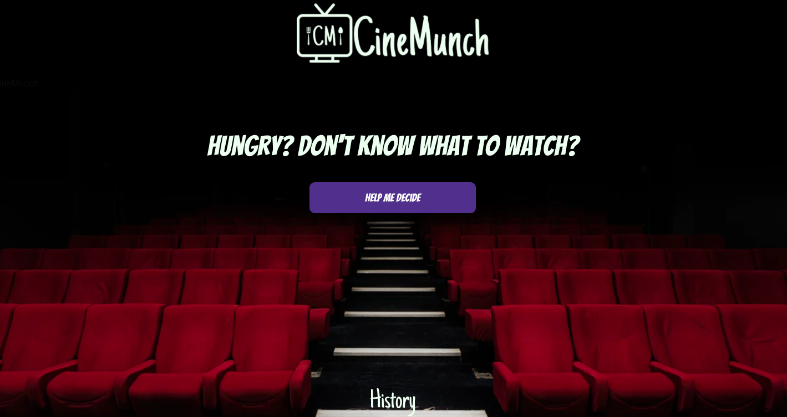
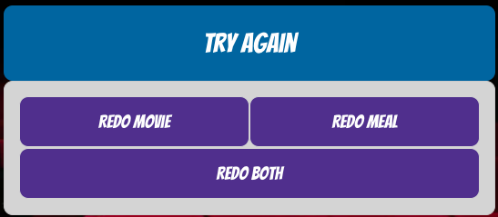
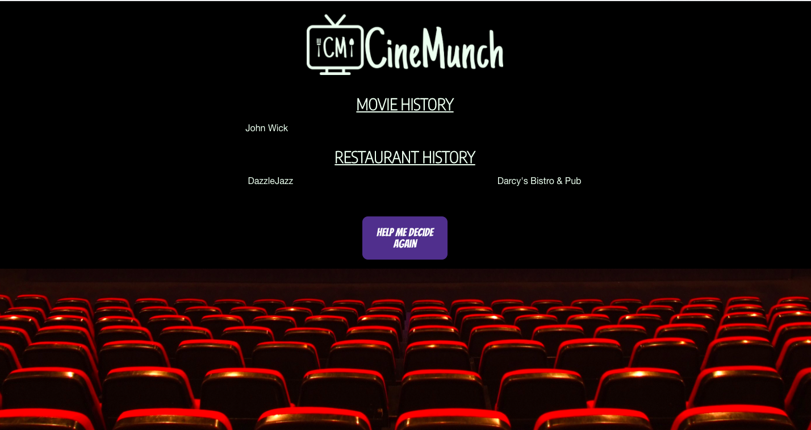

# CineMunch

## Description
The purpose of this application is to help those who struggle with choosing their nightly film entertainment as well as suggest a trendy restaurant in Denver to order from. When you first visit this site, you will be presented with a landing page, where you will need to click the "Help Me Decide" button. Once that button is pressed, you will be redirected to a page that displays a random movie title, it's corresponding poster, and it's summary. You will also see a random restaurant in Denver, along with a picture from the restaurant, the type of cuisine it is, and a link to its menu. Directly under both the movie and restaurant options, are two separate "Save Movie" and "Save Meal" buttons. By clicking these, you can save your choices and refer back to them by clicking the "History" button on the page. 

At the bottom of the page, is a "Try Again" dropdown button, so you can generate either a random movie separately, a random restaurant separately, or both at the same time. 

As a team, we felt motivated to create an application like this because there have been one too many nights in each of our independent lives where we have struggled to decide on what movie to watch in our down time, as well as coming up with a dinner option to pair with it. This application simplifies this process, so now whoever uses it can save time deciding what to watch and where to eat in Denver, and have new options to try each time. 

Overall, we faced challenges such as working together in GitHub to merge our individual changes while preventing the least amount of merge conflicts. Understanding git commands and which order they need to be in was a reoccuring challenge that we eventually moved past as a team. The other speedbump we encountered was working on individual pieces of code that depended on other files or code blocks written by another team member. Being solely responsible for certain aspects of the project was an adjustment for all of us, but luckily, it did not take us too much time to get into the swing of things and adapt to our individual and collective working styles. 

## Link to Deployed Application
[Link to CineMunch](https://lasettebrown.github.io/project-1-cinemunch-ap-for-night-inn/)

## Table of Contents (Optional)
## Installation
- [Usage](#Usage)
- [Credits](#Credits)
- [Features](#Features)

## Installation
No installation required - all the user needs to do to access the application is to click [this link](https://lasettebrown.github.io/project-1-cinemunch-ap-for-night-inn/)

## Usage
Provide instructions and examples for use. Include screenshots as needed.
To add a screenshot, create an assets/images folder in your repository and upload your screenshot to it. Then, using the relative filepath, add it to your README using the following syntax:

## Credits
All collaborators include:
* [Lasette Brown](https://github.com/LasetteBrown)
* [Jeff Cameron](https://github.com/jeffgcameron)
* [Lauren Penenburgh](https://github.com/lpenenburgh)
* [Kelsey Benedict](https://github.com/kelseybenedict)

A special thank you to our instructor Dan, and TAs Allana and Jon for helping us navigate merging in GitHub as well as debugging some of our logic in our code. 

We used APIs from [Zomato Developers](https://developers.zomato.com/documentation#/) and [The Movie DB](https://www.themoviedb.org/documentation/api). We also utilized Postman to test and troubleshoot our APIs. 

For styling, we used [Foundation by Zurb](https://get.foundation/sites.html) as well as [Google Fonts](https://fonts.google.com/)

For our background image, we used an image from Unsplash made by [Felix Mooneeram](https://unsplash.com/@felixmooneeram). We also used placeholder images from Unsplash made by [Kelly Sikkema](https://unsplash.com/@kellysikkema?utm_source=unsplash&utm_medium=referral&utm_content=creditCopyText).

We also made a logo, which was created using [Gravit](https://designer.gravit.io/?psd-campaign=1693840974&psd-adgroup=102082661913&psd-kw=gravit&gclid=EAIaIQobChMI8oGHjaTt7gIVwfDjBx0T4w3MEAAYASAAEgKBrPD_BwE&campaignid=1693840974&adgroupid=102082661913&adid=433148240551&gclid=EAIaIQobChMI8oGHjaTt7gIVwfDjBx0T4w3MEAAYASAAEgKBrPD_Bw).

## Features
In our application, the user has the option of generating new movie and restaraunt choices by selecting the "Try Again" button. By doing this, you can either select to redo the movie or restaurant separately, or redo both of them. 

Under each movie and restaurant choice, the user has the option of saving their movie or meal choice to local storage. This is viewable by clicking the "History" button at the button of the screen, where the user will be redirected to a separate page to look at their saved choices. 

# Google Slides Presentation
[Click here to view our presentation](https://docs.google.com/presentation/d/1ku9Q3lYiwbY8iuADu1CdrXGcGPRsqVXrSGJ_j1zafW8/edit?ts=601eeda4#slide=id.p)

